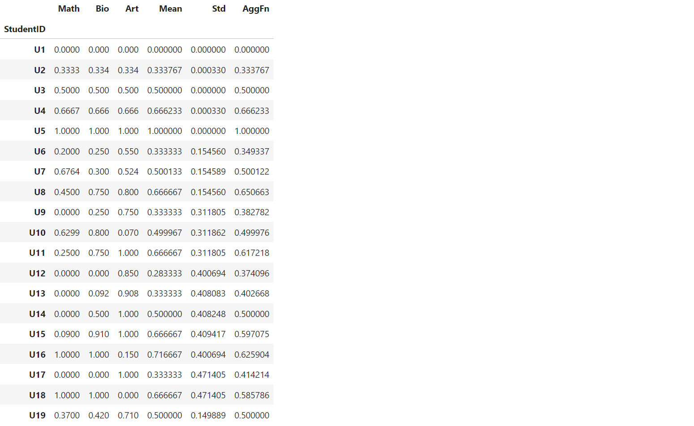
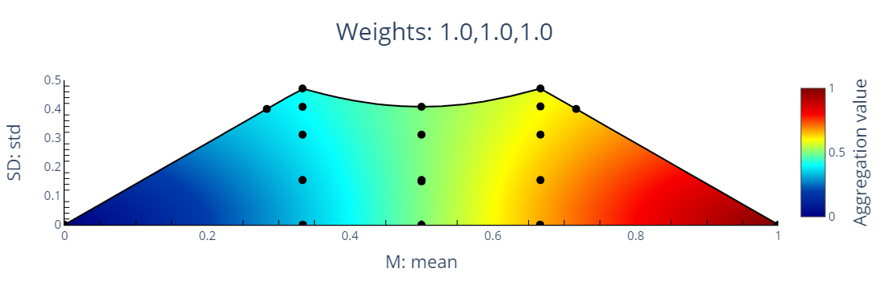

# TOPSIS ranking and interpretation using WMSD-space


This repository hosts the code for **WMSDTransformer** - a scikit-learn compatible python library, that lets you create TOPSIS rankings of alternatives, visualize rankings in WMSD space, and get suggestions for improvement actions. 
<!-- Check out the project's [documentation](https://msdtransformer.readthedocs.io/en/latest/index.html) to learn more about using the WMSDTransformer.  -->

## Requirements

WMSDTransformer uses PySCIPOpt to determine exact WMSD boundaries quickly. If you use conda, you should be fine performing the follwoing command (easier option):
```console
conda install --channel conda-forge pyscipopt
``` 
If you use PyPI, then you will need a working installation of the [SCIP Optimization
Suite](https://www.scipopt.org/) (harder option, but might run faster). Please, make sure that your SCIP installation works, before installing WMSDTransformer. For more details on how to install SCIP, please refer to the [PySCIPOpt documentation](https://github.com/scipopt/PySCIPOpt/blob/master/INSTALL.md).

After installing PySCIPOpt (or if you already have SCIP installed), you can install the other dependencies by running:
```console
pip install -r requirements.txt
```
## Installation

<!-- ### From PyPI

This is the simplest (one-command) install method is to run the following command in your terminal:

```console
pip install WMSDtransformer
```

### From source -->

Once you have all the dependencies, you can install WMSDTransformer from source. To do so, clone the repository and run the following command in the root directory of the repository:

```console
pip install .
```

## Quickstart

```python
import pandas as pd
from WMSDTransformer import WMSDTransformer

df = pd.read_csv("../data/students.csv", sep=';', index_col= 0)
students_transformer = WMSDTransformer("R") # Relative distance
students_transformer.fit(df, expert_range=[[0,100],[1,6],[1,6]])
students_transformer.transform(df)
```



```python
students_transformer.show_ranking()
```


```python
students_transformer.plot()
```



## Citation

If you use this project in your research, please consider citing the following papers:

- [Susmaga, R. *et al.* (2023) MSD-space: Visualizing the inner-workings of TOPSIS aggregations. *European Journal of Operational Research*, 308(1), 229-242.](https://doi.org/10.1016/j.ejor.2022.12.003)
- [Susmaga, R. *et al.* (2023) Towards Explainable TOPSIS: Visual Insights into the Effects of Weights and Aggregations on Rankings. Arxiv preprint.](
https://doi.org/10.48550/arXiv.2306.07706)

